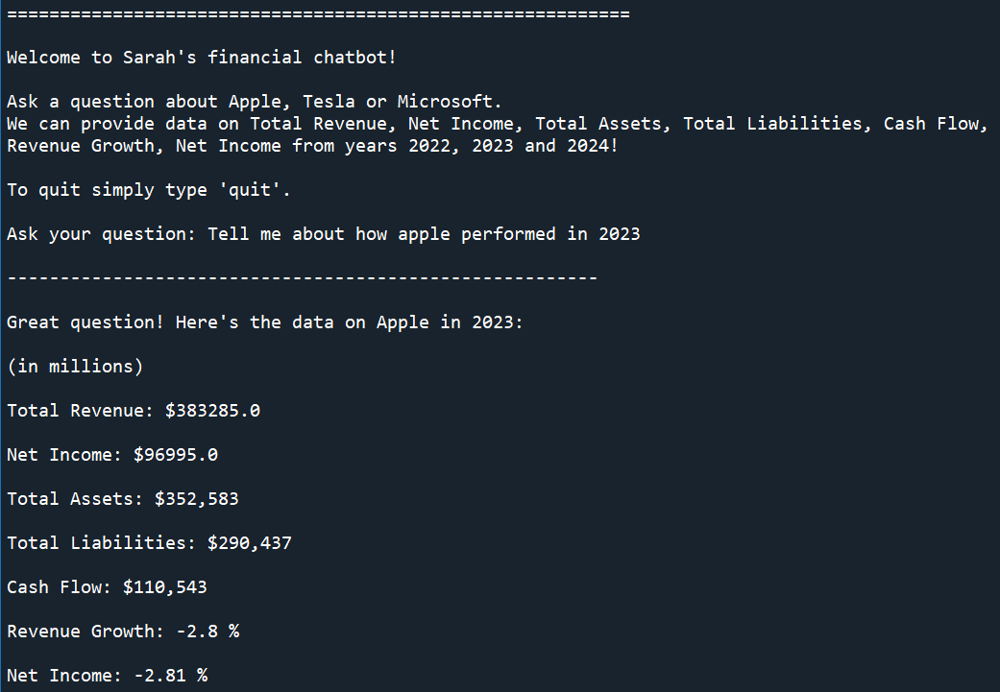
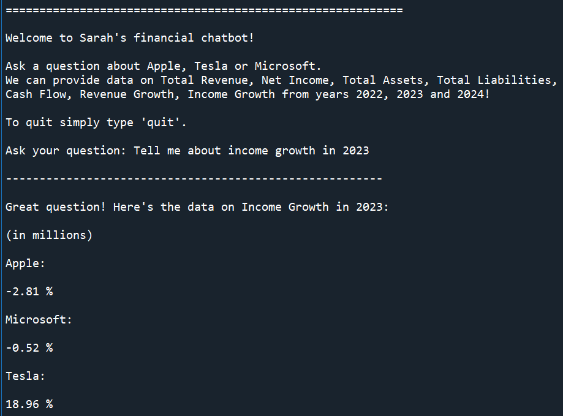
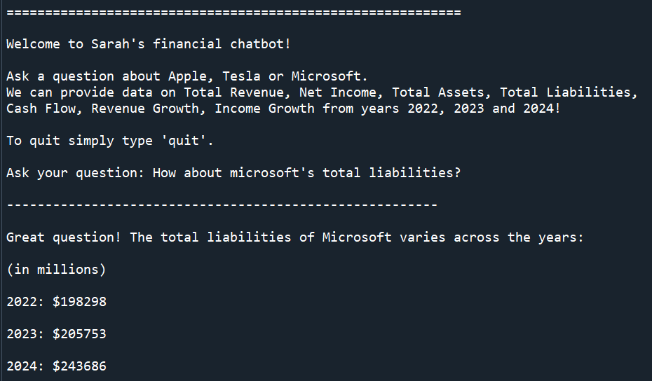

# Natural-Language-Mapping-Financial-Chatbot
A rule based chatbot which interprets natural language mapping into data indexes to generate question specific responses retrieving necessary data.

Initially developed as part of BCG X's GenAI course on Forage, but developed further out of interest. 

Data was found in the 10K public files on Apple Tesla and Microsoft and compiled into an excel file which is uploaded in this repository.

## Features 

-	Reads excel data file removing commas and calculating revenue growth and net income growth, organising data into a dictionary of pandas dataframes 

-	interprets natural langue questions by scanning for company names, key words and years, mapping any language input into three numerical indexes

-	interprets the lack (None value) or presence (numerical value) of all combination of indexes by leading to a generalised responce using rule based logic

-	generates responces with specific data based on the indexes present in the question

-	7 generalised responces written that can respond to 128 possible combinations of company, key word and year questions including all combinations of a lack of any or all of these.

-	

## Example Output

  

  

  

  
</p
